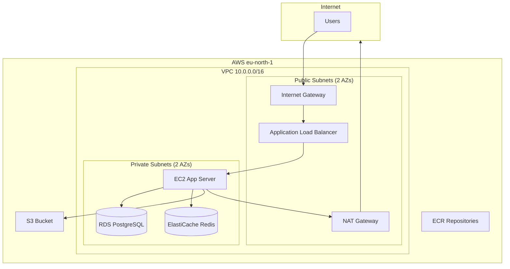

# AfriMart Infrastructure Architecture

**Phase 1: Terraform Infrastructure**

---

## High-Level Diagram



---

## Network Layout

```
                    ┌─────────────────────────────────────────────────────┐
                    │                     VPC 10.0.0.0/16                  │
                    │                                                      │
    Internet ───────┤  ┌───────────────┐  ┌───────────────┐               │
                    │  │ Public Sub 1  │  │ Public Sub 2  │               │
                    │  │ 10.0.0.0/20   │  │ 10.0.1.0/20   │               │
                    │  │ AZ-a          │  │ AZ-b          │               │
                    │  │ • IGW         │  │               │               │
                    │  │ • NAT GW      │  │               │               │
                    │  │ • ALB (opt)   │  │               │               │
                    │  └───────┬───────┘  └───────┬───────┘               │
                    │          │                   │                       │
                    │  ┌───────▼───────┐  ┌───────▼───────┐               │
                    │  │ Private Sub 1 │  │ Private Sub 2 │               │
                    │  │ 10.0.16.0/20  │  │ 10.0.17.0/20  │               │
                    │  │ AZ-a          │  │ AZ-b          │               │
                    │  │ • EC2         │  │               │               │
                    │  │ • RDS         │  │ • RDS (Multi) │               │
                    │  │ • Redis       │  │               │               │
                    │  └───────────────┘  └───────────────┘               │
                    └─────────────────────────────────────────────────────┘
```

---

## Security Groups

| SG       | Ingress                               | Egress     | Purpose             |
|----------|----------------------------------------|------------|---------------------|
| ALB      | 80, 443 from 0.0.0.0/0                | All        | Web traffic         |
| App      | 3000 from ALB, 22 from SSH CIDR       | All        | EC2 application     |
| DB       | 5432 from App SG                      | All        | RDS PostgreSQL      |
| Redis    | 6379 (VPC)                            | All        | ElastiCache         |

---

## Terraform Modules

| Module         | Resources                                           |
|----------------|-----------------------------------------------------|
| vpc            | VPC, IGW, subnets, NAT GW, route tables             |
| security-groups| ALB, App, DB, Redis SGs                             |
| rds            | DB subnet group, PostgreSQL instance                |
| redis          | ElastiCache subnet group, Redis cluster             |
| s3             | Bucket, versioning, encryption, public block        |
| ecr            | Backend and frontend repositories                   |
| iam            | EC2 role, instance profile, S3/CloudWatch policies  |
| ec2            | Launch template, EC2 instance                       |
| alb            | ALB, target group, listener (optional)              |

---

## Draw.io / Lucidchart

Export this diagram for draw.io or Lucidchart:

- **VPC** (rectangle) → contains subnets
- **Public subnets** → Internet Gateway, NAT Gateway, ALB
- **Private subnets** → EC2, RDS, Redis
- **External** → S3, ECR
- **Arrows** → data flow
