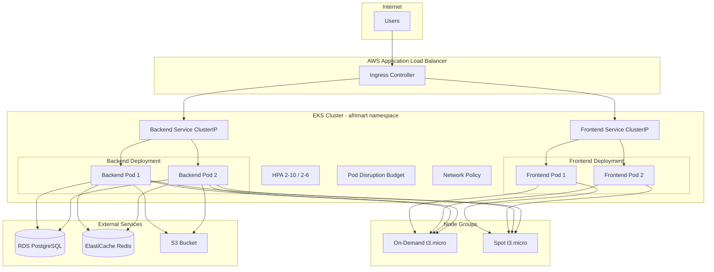

# Phase 5: Kubernetes Deployment

This document covers the AfriMart Kubernetes deployment on AWS EKS.

---

## Phase 5 Task Checklist

### 1. EKS Cluster Setup
| Task | Status | Implementation |
|------|--------|----------------|
| Create EKS cluster (Terraform) | ✓ | `terraform/environments/eks/` |
| Node groups (on-demand + spot) | ✓ | `on_demand` + `spot` in EKS module |
| kubectl access | ✓ | `aws eks update-kubeconfig` |
| AWS Load Balancer Controller | ✓ | Install via Helm (see below) |

### 2. Kubernetes Manifests
| Task | Status | File |
|------|--------|------|
| Deployments (backend, frontend) | ✓ | `k8s/*-deployment.yaml` |
| Services (ClusterIP) | ✓ | `k8s/*-service.yaml` |
| ConfigMaps | ✓ | `k8s/configmap.yaml` |
| Secrets | ✓ | `k8s/secret.yaml.example` → `secret.yaml` |
| Horizontal Pod Autoscaler | ✓ | `k8s/hpa.yaml` |
| Ingress | ✓ | `k8s/ingress.yaml` |
| PersistentVolumeClaims | ✓ | In `backend-deployment.yaml` (PVC defined; deployment uses emptyDir for uploads) |

### 3. Helm Charts (Bonus)
| Task | Status | Implementation |
|------|--------|----------------|
| Helm charts | ✓ | `helm/afrimart/` |
| Values for environments | ✓ | `values-dev.yaml`, `values-prod.yaml` |
| Helm deployment | ✓ | `helm install afrimart helm/afrimart -f values-dev.yaml` |

### 4. Advanced Features
| Task | Status | Implementation |
|------|--------|----------------|
| Network policies | ✓ | `k8s/network-policy.yaml` |
| Resource limits/requests | ✓ | In Deployments |
| Liveness/readiness probes | ✓ | In Deployments |
| Pod Disruption Budgets | ✓ | `k8s/pdb.yaml` |

### Deliverables
- ✓ `k8s/` – all manifests
- ✓ `helm/afrimart/` – Helm charts
- ✓ Cluster architecture diagram (below)
- ✓ Resource utilization analysis – [RESOURCE_UTILIZATION.md](RESOURCE_UTILIZATION.md)

---

## Table of Contents

1. [Overview](#overview)
2. [Architecture](#architecture)
3. [Prerequisites](#prerequisites)
4. [EKS Cluster Setup](#eks-cluster-setup)
5. [AWS Load Balancer Controller](#aws-load-balancer-controller)
6. [Deployment Options](#deployment-options)
7. [Resource Utilization](#resource-utilization)
8. [Troubleshooting](#troubleshooting)

---

## Overview

Phase 5 provides:

- **EKS Cluster** – Managed Kubernetes with on-demand + spot node groups
- **Kubernetes Manifests** – Deployments, Services, ConfigMaps, Secrets, HPA, Ingress, PDB, NetworkPolicy
- **Helm Charts** – Parameterized deployment for dev/staging/prod
- **HA Design** – Multi-replica, PDBs, HPA, resource limits

---

## Architecture

### Cluster Architecture Diagram (Mermaid)



### ASCII Diagram

```
                    ┌─────────────────────────────────────────────┐
                    │                  Internet                    │
                    └─────────────────────┬───────────────────────┘
                                          │
                    ┌─────────────────────▼───────────────────────┐
                    │         AWS Application Load Balancer        │
                    │              (via Ingress ALB)               │
                    └─────────────────────┬───────────────────────┘
                                          │
         ┌────────────────────────────────┼────────────────────────────────┐
         │                    EKS Cluster (VPC)                             │
         │  ┌─────────────────────────────┴─────────────────────────────┐  │
         │  │                     afrimart namespace                     │  │
         │  │  ┌──────────────┐  ┌──────────────┐  ┌──────────────────┐ │  │
         │  │  │   Ingress    │  │   Frontend   │  │     Backend      │ │  │
         │  │  │  (ALB rules) │  │  (2+ pods)   │  │   (2+ pods)      │ │  │
         │  │  └──────────────┘  └──────┬───────┘  └────────┬─────────┘ │  │
         │  │                           │                    │          │  │
         │  │                    ┌──────▼────────────────────▼──────┐   │  │
         │  │                    │  Services (ClusterIP)             │   │  │
         │  │                    │  HPA, PDB, NetworkPolicy          │   │  │
         │  │                    └──────────────────────────────────┘   │  │
         │  └───────────────────────────────────────────────────────────┘  │
         │                                                                  │
         │  Node Groups: on-demand (t3.micro) + spot (t3.micro)             │
         └──────────────────────────┬───────────────────────────────────────┘
                                    │
         ┌──────────────────────────┼──────────────────────────┐
         │                          │                          │
         ▼                          ▼                          ▼
┌─────────────────┐     ┌─────────────────┐     ┌─────────────────┐
│   RDS Postgres  │     │ ElastiCache     │     │   S3 Bucket     │
│   (private)     │     │ Redis (private) │     │   (uploads)     │
└─────────────────┘     └─────────────────┘     └─────────────────┘
```

---

## Prerequisites

- AWS CLI configured
- Terraform >= 1.0
- kubectl
- Helm 3 (for Helm deployment)
- Docker images pushed to GHCR or ECR

---

## EKS Cluster Setup

### 1. Deploy infrastructure (Terraform)

```bash
cd terraform/environments/eks
terraform init
terraform plan -var="db_password=YourSecurePassword"
terraform apply -var="db_password=YourSecurePassword"
```

### 2. Configure kubectl

```bash
# Output from Terraform
aws eks update-kubeconfig --region eu-north-1 --name afrimart-eks
kubectl get nodes
```

### 3. Tag subnets

The EKS module tags subnets for `kubernetes.io/cluster/*` and load balancer discovery. No manual tagging needed.

---

## AWS Load Balancer Controller

The Ingress uses the AWS Load Balancer Controller. Install it after the cluster is ready.

### IRSA (IAM Roles for Service Accounts)

The Load Balancer Controller needs IAM permissions to create ALBs and target groups. Use IRSA:

1. **Create IAM policy** for the controller (per [AWS docs](https://kubernetes-sigs.github.io/aws-load-balancer-controller/v2.6/deploy/installation/)):

   ```bash
   curl -o iam-policy.json https://raw.githubusercontent.com/kubernetes-sigs/aws-load-balancer-controller/v2.6.2/docs/install/iam_policy.json
   aws iam create-policy --policy-name AWSLoadBalancerControllerIAMPolicy --policy-document file://iam-policy.json
   ```

2. **Create IAM role and trust policy** for the controller service account (use `eksctl create iamserviceaccount` or Terraform with OIDC provider):

   ```bash
   eksctl create iamserviceaccount \
     --cluster=afrimart-eks \
     --namespace=kube-system \
     --name=aws-load-balancer-controller \
     --attach-policy-arn=arn:aws:iam::ACCOUNT_ID:policy/AWSLoadBalancerControllerIAMPolicy \
     --override-existing-serviceaccounts \
     --approve
   ```

3. **Install cert-manager** (required by the controller):

   ```bash
   kubectl apply -f https://github.com/cert-manager/cert-manager/releases/download/v1.13.0/cert-manager.yaml
   ```

4. **Install AWS Load Balancer Controller**:

   ```bash
   helm repo add eks https://aws.github.io/eks-charts
   helm install aws-load-balancer-controller eks/aws-load-balancer-controller \
     -n kube-system \
     --set clusterName=afrimart-eks \
     --set serviceAccount.create=false \
     --set serviceAccount.name=aws-load-balancer-controller
   ```

The EKS Terraform module enables IRSA (`enable_irsa = true`) and exposes the OIDC issuer URL. Use the AWS docs for full IRSA setup if not using eksctl.

---

## Deployment Options

### Option A: Raw Manifests (k8s/)

1. Create secret from example:

   ```bash
   cp k8s/secret.yaml.example k8s/secret.yaml
   # Edit secret.yaml with real values (RDS, Redis, JWT, etc.)
   ```

2. Apply manifests in order:

   ```bash
   kubectl apply -f k8s/namespace.yaml
   kubectl apply -f k8s/configmap.yaml
   kubectl apply -f k8s/secret.yaml
   kubectl apply -f k8s/backend-deployment.yaml
   kubectl apply -f k8s/backend-service.yaml
   kubectl apply -f k8s/frontend-deployment.yaml
   kubectl apply -f k8s/frontend-service.yaml
   kubectl apply -f k8s/hpa.yaml
   kubectl apply -f k8s/pdb.yaml
   kubectl apply -f k8s/network-policy.yaml
   kubectl apply -f k8s/ingress.yaml
   ```

   Or apply all at once (namespace first):

   ```bash
   kubectl apply -f k8s/
   ```

### Option B: Helm

1. Create secret (must exist before Helm install):

   ```bash
   kubectl create namespace afrimart
   kubectl create secret generic afrimart-secrets -n afrimart \
     --from-literal=DATABASE_URL="postgresql://..." \
     --from-literal=REDIS_URL="redis://..." \
     --from-literal=JWT_SECRET="your-secret" \
     --from-literal=FRONTEND_URL="https://..." \
     # Add other secret keys as needed
   ```

2. Install with Helm:

   ```bash
   helm install afrimart helm/afrimart -n afrimart -f helm/afrimart/values-dev.yaml
   # Or for production:
   helm install afrimart helm/afrimart -n afrimart -f helm/afrimart/values-prod.yaml
   ```

3. Upgrade:

   ```bash
   helm upgrade afrimart helm/afrimart -n afrimart -f helm/afrimart/values-prod.yaml
   ```

### Using ECR Instead of GHCR

ECR repos (from Terraform) are `afrimart/backend` and `afrimart/frontend`. To use ECR:

**Option 1 – `values-ecr.yaml`** (edit `imageRegistry` with your AWS account ID):

```bash
helm install afrimart helm/afrimart -n afrimart \
  -f helm/afrimart/values-dev.yaml -f helm/afrimart/values-ecr.yaml
```

**Option 2 – set registry from Terraform output:**

```bash
ECR_REGISTRY=$(cd terraform/environments/eks && terraform output -raw ecr_backend_url | sed 's|/afrimart/backend||')
helm install afrimart helm/afrimart -n afrimart \
  -f helm/afrimart/values-dev.yaml -f helm/afrimart/values-ecr.yaml \
  --set imageRegistry=$ECR_REGISTRY
```

ECR nodes need pull access (EKS node IAM role or `imagePullSecrets` for ECR auth).

---

## Resource Utilization

| Component   | Requests        | Limits        | Replicas | Notes                                                                 |
|------------|-----------------|---------------|----------|-----------------------------------------------------------------------|
| Backend    | 100m CPU, 256Mi | 500m, 512Mi   | 2–10     | HPA on CPU 70%, memory 80%; scaling behavior configured               |
| Frontend   | 50m CPU, 64Mi   | 200m, 128Mi   | 2–6      | HPA on CPU 70%                                                        |
| Storage    | -               | -             | -        | Backend: uploads and logs use emptyDir (ephemeral). PVC defined for uploads if needed. |

**Replicas:** Deployments specify `replicas: 1`; when HPA is applied, it scales to min 2 (backend and frontend).

**Node sizing:** On-demand t3.micro (2 vCPU, 1 GiB) × 2, Spot t3.micro × 1. Adjust in `terraform/environments/eks/variables.tf`.

---

## Evaluation Criteria Mapping

| Criterion              | Weight | Implementation                                                                 |
|------------------------|--------|--------------------------------------------------------------------------------|
| Manifest completeness  | 30%    | Deployments, Services, ConfigMaps, Secrets, HPA, Ingress, PDB, PVC, NetworkPolicy |
| High availability      | 25%    | HPA min 2 replicas, PDB minAvailable: 1, rolling updates maxUnavailable: 0, multi-node groups |
| Resource optimization  | 25%    | Requests/limits on all pods, HPA (backend: CPU+memory; frontend: CPU), scaling behavior |
| Documentation          | 20%    | This doc, architecture diagram, [RESOURCE_UTILIZATION.md](RESOURCE_UTILIZATION.md), Helm values |

---

## Troubleshooting

| Issue                       | Solution                                                                 |
|-----------------------------|--------------------------------------------------------------------------|
| Pods pending                | Check node capacity; scale node group or fix resource requests           |
| ImagePullBackOff            | Configure image pull secret for GHCR/ECR                                 |
| Backend crash / DB connect  | Verify DATABASE_URL, RDS security group allows EKS nodes                 |
| Ingress not creating ALB    | Ensure AWS Load Balancer Controller is installed and has IAM permissions |
| PVC pending                 | Ensure EBS CSI driver or default StorageClass (gp3) exists               |
| Uploads not persisting      | Backend uses emptyDir; to persist uploads, mount the `backend-uploads` PVC in the deployment |

---

## Related

- [DOCKER_PHASE3.md](DOCKER_PHASE3.md) – Container images
- [DEVOPS_GUIDE.md](DEVOPS_GUIDE.md) – Terraform + Ansible
- [../README.md](../README.md) – Repository overview
